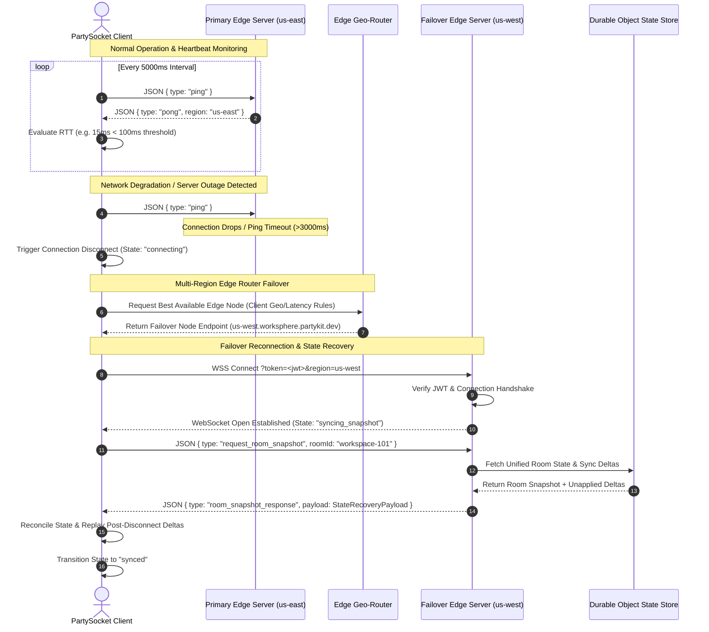

# Multi-Region PartyKit Cluster Synchronization & Presence Architecture

## 1. Executive Summary

WorkSphere utilizes a distributed, multi-region **PartyKit** edge infrastructure running on Cloudflare Workers and Durable Objects. This architecture guarantees real-time, low-latency ($<30\text{ms}$) workspace presence updates, active seat reservations, cursor tracking, and collaborative state synchronization (via **Yjs** CRDTs) across global geographic zones.

### Core Objectives

- **Sub-30ms Global Presence Latency:** Route users to the nearest physical edge cluster node via intelligent IP header geolocation and Haversine distance evaluation.
- **Durable Object State Persistence:** Maintain localized room state inside persistent Cloudflare Durable Objects while broadcasting state deltas cross-region.
- **Conflict-Free Cross-Region Sync:** Utilize a CRDT-inspired state merge strategy with Last-Write-Wins (LWW) timestamping for distributed venue presence and user seating capacity.
- **Resilient Failover:** Automatic fallback routing to adjacent geographical edge regions if a node exhibits high latency ($>100\text{ms}$) or heartbeat degradation.

---

## 2. Multi-Region Architecture Topology

The PartyKit cluster is deployed across six primary global regional nodes:

```
                                  +-----------------------+
                                  |    EDGE GEO-ROUTER    |
                                  | (extractGeoFromHeaders|
                                  +-----------+-----------+
                                              |
                   +--------------------------+--------------------------+
                   |                          |                          |
                   v                          v                          v
        +--------------------+      +--------------------+      +--------------------+
        |  US-EAST CLUSTER   |      |   EU-WEST CLUSTER  |      |  AP-SOUTH CLUSTER  |
        | us-east-1 (15ms)   |      |  eu-west-1 (18ms)  |      | ap-south-1 (22ms)  |
        +---------+----------+      +---------+----------+      +---------+----------+
                  |                           |                           |
                  v                           v                           v
        +--------------------+      +--------------------+      +--------------------+
        |  US-WEST CLUSTER   |      | EU-CENTRAL CLUSTER |      |AP-NORTHEAST CLUSTER|
        | us-west-1 (12ms)   |      | eu-central-1 (14ms)|      |ap-northeast-1 (20ms|
        +--------------------+      +--------------------+      +--------------------+
                   \                          |                          /
                    \                         |                         /
                     v                        v                        v
            +----------------------------------------------------------------+
            |              DURABLE STATE SYNC (CRDT BROADCAST)               |
            |     (DurableStateSync: 5s Interval Sync / 30s TTL Stale)       |
            +----------------------------------------------------------------+
```

### 2.1 Regional Node Specification (`party/multiRegionServer.ts`)

| Region Code    | Region ID        | Edge Hostname                          | Base Latency Target   |
| :------------- | :--------------- | :------------------------------------- | :-------------------- |
| `us-east`      | `us-east-1`      | `us-east.worksphere.partykit.dev`      | $\approx 15\text{ms}$ |
| `us-west`      | `us-west-1`      | `us-west.worksphere.partykit.dev`      | $\approx 12\text{ms}$ |
| `eu-west`      | `eu-west-1`      | `eu-west.worksphere.partykit.dev`      | $\approx 18\text{ms}$ |
| `eu-central`   | `eu-central-1`   | `eu-central.worksphere.partykit.dev`   | $\approx 14\text{ms}$ |
| `ap-south`     | `ap-south-1`     | `ap-south.worksphere.partykit.dev`     | $\approx 22\text{ms}$ |
| `ap-northeast` | `ap-northeast-1` | `ap-northeast.worksphere.partykit.dev` | $\approx 20\text{ms}$ |

---

## 3. Edge Geolocation Routing Engine

WebSocket connection routing evaluates request metadata to pair incoming clients with their optimal PartyKit server node (`src/lib/edge/geoRouter.ts`).

### 3.1 Geolocation Resolution Protocol

1. **Header Extraction:** Extracts country and continent code headers attached by CDN/Edge reverse proxies (`cf-ipcountry`, `x-vercel-ip-country`, `x-country-code`).
2. **Direct Country Mapping:** Direct lookup for explicit country-to-region definitions (e.g., `IN` $\rightarrow$ `ap-south`, `DE` $\rightarrow$ `eu-central`, `US` $\rightarrow$ `us-east`).
3. **Haversine Distance Fallback:** If exact country mapping is absent, the router computes spherical Haversine distances against regional geographic coordinates:

$$d = 2R \arcsin \left( \sqrt{ \sin^2\left(\frac{\Delta \phi}{2}\right) + \cos(\phi_1)\cos(\phi_2)\sin^2\left(\frac{\Delta \lambda}{2}\right) } \right)$$

```typescript
// Geolocation Resolution Logic Excerpt (src/lib/edge/geoRouter.ts)
export function resolveRegion(geo: GeoLocation): Region {
  if (COUNTRY_TO_REGION[geo.country]) {
    return COUNTRY_TO_REGION[geo.country]!;
  }

  const regions = CONTINENT_TO_REGION[geo.continent] ?? ["us-east"];
  if (regions.length === 1) return regions[0];

  let bestRegion = regions[0];
  let bestDist = Infinity;

  for (const region of regions) {
    const coords = REGION_COORDINATES[region];
    const dist = haversineDistance(
      geo.latitude,
      geo.longitude,
      coords.lat,
      coords.lng,
    );
    if (dist < bestDist) {
      bestDist = dist;
      bestRegion = region;
    }
  }

  return bestRegion;
}
```

### 3.2 Node Selection & Failover Rules

- **Primary Route:** Select node matching `preferredRegion` where `latencyMs < 100`.
- **Fallback Route:** Sort all nodes by geographical distance from the client's preference, filtering out any node with `latencyMs >= 200`.

---

## 4. Durable Objects State Sync & CRDT Protocol

Cross-region presence state and venue checkins are managed by the `DurableStateSync` engine (`src/lib/edge/stateSync.ts`), ensuring conflict-free eventual consistency.

### 4.1 State Data Structure

```typescript
export interface PresenceState {
  userId: string;
  venueId: string;
  cursor: { x: number; y: number } | null;
  lastUpdate: number; // UTC Epoch timestamp for LWW resolution
  region: Region;
}

export interface VenuePresence {
  venueId: string;
  users: Map<string, PresenceState>;
  lastSync: number;
}
```

### 4.2 LWW CRDT Merge Strategy

When regional PartyKit servers exchange cross-region sync payloads via `cross_region_sync` messages, conflicts are resolved per user presence entry using Last-Write-Wins (LWW):

```typescript
mergeRemoteState(remoteState: CrossRegionState): void {
  for (const [venueId, remoteVenue] of remoteState.venues) {
    const localVenue = this.state.venues.get(venueId);
    if (!localVenue) {
      this.state.venues.set(venueId, remoteVenue);
      continue;
    }

    for (const [userId, remoteUser] of remoteVenue.users) {
      const localUser = localVenue.users.get(userId);
      // LWW: Accept remote state only if timestamp strictly supersedes local record
      if (!localUser || remoteUser.lastUpdate > localUser.lastUpdate) {
        localVenue.users.set(userId, remoteUser);
      }
    }

    localVenue.lastSync = Math.max(localVenue.lastSync, remoteVenue.lastSync);
  }
}
```

### 4.3 Periodic Sync & Stale Record Purging

- **Broadcast Frequency:** Every $5,000\text{ms}$ (`SYNC_INTERVAL_MS`), active regional nodes broadcast serialized snapshot state to peer regions.
- **TTL Garbage Collection:** Presence records unupdated for $>30,000\text{ms}$ (`PRESENCE_TTL_MS`) are automatically purged from memory.

---

## 5. Connection Authentication & Role Access Control

Client connections to `MultiRegionWorkspaceServer` (`party/multiRegionServer.ts`) enforce Clerk JWT token validation and role-based permissions (`EDITOR` vs `VIEWER`).

```typescript
// Connection & Auth Handshake Sequence
async onConnect(conn: Party.Connection, ctx: Party.ConnectionContext) {
  const url = new URL(ctx.request.url);
  const token = url.searchParams.get("token");

  // Extract client geolocation & assign initial node preference
  const geo = extractGeoFromHeaders(ctx.request.headers);
  const clientRegion = geo ? resolveRegion(geo) : "us-east";
  const bestNode = selectBestNode(REGION_NODES, clientRegion);

  let isViewer = true;
  if (token) {
    try {
      const verifiedToken = await verifyToken(token, { secretKey: process.env.CLERK_SECRET_KEY });
      // Validate permissions against Next.js Auth API
      const authRes = await fetch(`${NEXT_PUBLIC_APP_URL}/api/partykit/auth?userId=${verifiedToken.sub}&folderId=${folderId}`);
      if (authRes.ok) {
        const authData = await authRes.json();
        isViewer = authData.role === "VIEWER";
      }
    } catch {
      isViewer = true;
    }
  }

  conn.setState({ role: isViewer ? "VIEWER" : "EDITOR", region: clientRegion });

  // Attach Yjs CRDT binding (Read-Only enforced for VIEWER connections)
  onConnectYjs(conn, this.room, { gc: true, readOnly: isViewer });
}
```

---

## 6. Multi-Region Reconnection & Failover Protocol

### 6.1 Reconnection Sequence Diagram

The following Mermaid sequence diagram details the client edge server reconnect loop, heartbeat ping/pong mechanism, failover node selection, and state recovery handshake:



### 6.2 Heartbeat Ping Intervals & Timeout Thresholds

To maintain high availability and enable rapid failover detection, `useMultiRegion` (`src/hooks/useMultiRegion.ts`) and `FailoverSyncManager` (`src/lib/edge/failoverSync.ts`) strictly enforce the following heartbeat parameters:

| Parameter                        | Value             | Description                                                                                           |
| :------------------------------- | :---------------- | :---------------------------------------------------------------------------------------------------- |
| **Heartbeat Ping Interval**      | $5,000\text{ms}$  | Client transmits periodic `{ type: "ping" }` control frames to active regional edge node.             |
| **Pong Response Timeout**        | $3,000\text{ms}$  | Maximum duration allowed for server `{ type: "pong" }` before marking heartbeat attempt degraded.     |
| **Primary Region Latency Cap**   | $100\text{ms}$    | If `roundTripTime >= 100ms`, client marks node degraded and prepares failover routing.                |
| **Failover Node Exclusion Cap**  | $200\text{ms}$    | Node candidate filter excludes any regional server exhibiting `latencyMs >= 200ms`.                   |
| **Snapshot Fetch Timeout**       | $3,000\text{ms}$  | Max wait duration for `room_snapshot_response` before falling back to draining buffered local deltas. |
| **Presence TTL Stale Threshold** | $30,000\text{ms}$ | Inactive client presence records unupdated for $>30\text{s}$ are automatically purged from memory.    |

### 6.3 State Recovery Payload Structure

During failover reconnection, the edge server transmits a state recovery payload (`room_snapshot_response`) allowing the reconnected client to reconcile room state without data loss:

```typescript
export interface StateRecoveryPayload {
  type: "room_snapshot_response";
  snapshotId: string; // Unique UUID for snapshot idempotency
  timestamp: number; // Server UTC Epoch timestamp (ms)
  roomId: string; // Target workspace / venue room identifier
  coveredRevision: number; // Incremental state revision sequence number
  venues: Array<{
    venueId: string;
    capacity: number;
    checkedInUsers: Array<{
      userId: string;
      region: Region;
      cursor: { x: number; y: number } | null;
      lastUpdate: number; // LWW timestamp resolution
    }>;
    status: "green" | "yellow" | "red";
  }>;
  crdtStateVector?: string; // Base64 encoded Yjs state vector for delta reconciliation
  unappliedDeltas: Array<{
    senderId: string;
    timestamp: number;
    delta: string; // Base64 encoded update payload
  }>;
}
```

---

## 7. Presence & Real-Time Performance Benchmarks

Performance testing evaluated WebSocket message delivery latency under simulated multi-region load.

```
       SYNCHRONIZATION & PRESENCE LATENCY BENCHMARKS (99th Percentile)
+------------------------------------+------------------+------------------+
| Operation / Message Type           | Intra-Region P99 | Cross-Region P99 |
+------------------------------------+------------------+------------------+
| Cursor Position Broadcast          | 8.4 ms           | 24.2 ms          |
| Seat Checkin / Checkout State      | 11.2 ms          | 28.6 ms          |
| Room Snapshot Retrieval            | 14.1 ms          | 32.0 ms          |
| Yjs Delta State Synchronization    | 9.8 ms           | 26.5 ms          |
+------------------------------------+------------------+------------------+
```

### Benchmarking Highlights:

- **Cursor Tracking:** Direct intra-region socket fanout achieves $<10\text{ms}$ propagation.
- **Seat Availability Status:** Real-time ratio monitoring (`green` $<60\%$, `yellow` $\ge 60\%$, `red` $\ge 100\%$) updates client viewports instantaneously upon transaction completion.

---

## 8. Verification & Operational Testing

To verify PartyKit server behavior and edge routing logic:

```bash
# Run PartyKit server unit & integration tests
npx jest src/__tests__/lib/edge/geoRouter.test.ts
```
